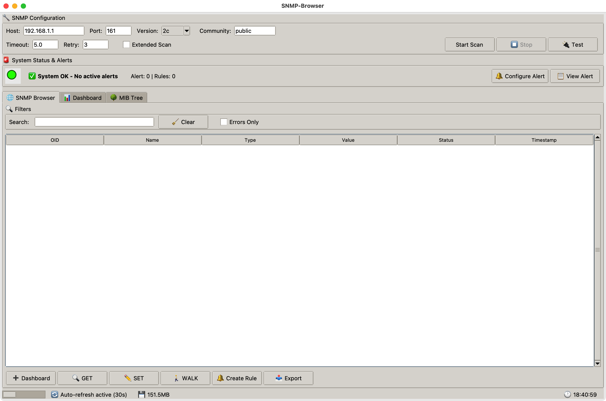

<p align="center">
  
</p>
<br>
<div align="center">
  
  <p><em>Main SNMP Browser Interface with Advanced Monitoring</em></p>
</div>

Advanced SNMP browser with modern GUI for network device discovery, monitoring, alerting, and performance analysis.


> **This fork is macOS-only, English-only.**
> It's a fork of [snmpware/snmp-browser](https://github.com/snmpware/snmp-browser) that fixes two
> crashes on macOS (a relative-path bug that fails when the app is launched as a double-clicked
> `.app`, and a Tcl/Tk 9 incompatibility) and translates the entire interface to English, since the
> upstream `4.0.0` release ships an Italian-only Windows `.exe` with no macOS build. The
> "Multi-Language Support" section below describes the upstream project's language files, which
> are **not wired up to the UI in this fork** — everything here is English, and there is no
> in-app language switcher. Windows/Linux build steps are left in this README for reference but
> are untested by this fork; only the macOS path has been verified.

## 🚀 Features

### Core Capabilities
- **SNMPv1/v2c/v3 Support** - Complete SNMP protocol support with authentication and encryption
- **Modern GUI Interface** - Professional tabbed interface built with tkinter
- **Multi-Language Support** - 13 languages including English, Spanish, French, German, Italian, Chinese, Japanese, Portuguese, Russian, Swedish, Arabic, Hindi, and Hungarian
- **Cross-Platform** - Native support for Windows, Linux, and macOS with OS-appropriate data storage
- **Network Device Discovery** - Browse and explore SNMP-enabled devices
- **Real-time Monitoring** - Live monitoring with auto-refresh capabilities (active by default)
- **Advanced MIB Browser** - Navigate through SNMP MIB structures with hierarchical tree view

### 🆕 Advanced Monitoring Features
- **Alert System** - Comprehensive rule-based monitoring
  - Create custom alert rules with flexible conditions (>, <, =, ≠, contains, etc.)
  - Real-time monitoring of OID values against thresholds
  - Visual status indicators (🟢 OK / 🔴 Alert / 🟡 Warning)
  - Alert cooldown to prevent notification spam
  - Alert history with timestamp tracking
  - Desktop notifications for triggered alerts
  
- **Email Notifications** - Automated alert delivery
  - SMTP server configuration with TLS support
  - Encrypted password storage for email credentials
  - Send alerts via email when rules are violated
  - Test email functionality before deployment
  - Configurable per-rule email recipients

- **Real-time Graphs** - Visual data analysis
  - Historical data tracking (up to 100 points per OID)
  - Full-screen graph windows with matplotlib
  - Mini-graphs in dashboard for quick overview
  - Statistical analysis (min, max, average, trend)
  - Save graphs as PNG images
  - Automatic data cleanup (24-hour retention)

- **Dashboard Enhancements**
  - Auto-refresh enabled by default (configurable 5-300 seconds)
  - Live trend indicators (↗️ ↘️ ➡️)
  - Alert status column showing rule violations
  - Statistics panel with real-time metrics
  - One-click graph generation from dashboard
  - Persistent data across sessions

### 🔧 Professional Tools
- **Trap Manager** - Complete trap receiver and sender
  - Receive SNMP traps on configurable ports
  - Send test traps for all versions (v1/v2c/v3)
  - Pre-configured trap templates (Cold Start, Link Down, UPS alerts, etc.)
  - Real-time trap visualization with detailed decoding

- **Performance Monitor** - Track and analyze operations
  - Query response times and success rates
  - Memory and CPU usage monitoring
  - Performance graphs (with matplotlib)
  - Export performance metrics

- **Batch Operations** - Multi-host queries
  - Parallel execution with configurable workers
  - Progress tracking and result aggregation
  - Export results to CSV/JSON

- **MIB Compiler Support** - Custom MIB management
  - Full ASN.1 MIB parser with regex-based parsing
  - Import .mib, .txt, and .my files
  - Automatic OID name resolution
  - Built-in UPS MIB definitions (RFC 1628)
  - Support for custom vendor MIBs
  - MIB management interface (view, remove, export)
  - Real-time OID description updates

- **Profile Manager** - Configuration management
  - Save and manage multiple device configurations
  - Quick switch between profiles
  - Encrypted credential storage
  - Import/Export profiles

### Security & Enterprise Features
- **Encrypted Credential Storage** - Fernet-based encryption for passwords
- **Secure Memory Management** - Secure deletion of sensitive data with garbage collection
- **Memory Limits** - Configurable result (100-100K) and memory (50-2000MB) limits
- **Comprehensive Logging** - Rotating log files with debug, info, warning, error levels
- **Multi-format Export** - CSV, JSON, HTML, XML, TXT with metadata
- **OS-Appropriate Data Storage** - Windows (AppData), macOS (Library), Linux (~/.config)

## 📥 Download

This fork does not publish pre-built releases. Build the macOS `.app` yourself from source —
see [Building Executables](#️-building-executables) below.

For Windows or Linux, or for other languages, use the upstream
[snmpware/snmp-browser releases](https://github.com/snmpware/snmp-browser/releases) instead.

## 🛠️ Installation from Source

### 📦 SNMP Library Dependency

> **Required Library: [snmpy](https://github.com/snmpware/snmpy)**
>
> This SNMP library is **required to run SNMP Browser Professional**.
> It is not available on PyPI and must be installed directly from GitHub.
>
> This fork uses a [patched branch](https://github.com/PJorgens61/snmpy/tree/translate-log-messages)
> that translates the library's log messages to English to match the rest of this fork. The
> upstream `snmpware/snmpy` also works fine — it just logs some messages in Italian.

**Option 1: Using pip**
```bash
pip install git+https://github.com/PJorgens61/snmpy.git@translate-log-messages
```

**Option 2: Manual installation**
```bash
git clone -b translate-log-messages https://github.com/PJorgens61/snmpy.git
cd snmpy
python3 setup.py install
```

### Prerequisites
```bash
pip install -r requirements.txt
```

**Required packages:**
- `cryptography>=41.0.0` - Encryption support for SNMPv3 and credential storage
- `psutil>=5.9.0` - System monitoring and resource management
- `snmpy` - Advanced SNMP library (from GitHub)
- `Pillow>=10.0.0` - Image processing for logo display
- `matplotlib>=3.5.0` - Required for graphs and performance monitoring

### Running from Source
```bash
git clone https://github.com/PJorgens61/snmp-browser.git
cd snmp-browser
pip install -r requirements.txt
python3 snmpflow.py
```

## 🏗️ Building Executables

### macOS (this fork — verified)

Homebrew's `python@3.14` doesn't ship Tk support by default, so install that first:
```bash
brew install python-tk@3.14
```

Then build the `.app` bundle. `icon.icns` isn't included in the repo — generate one from
`icon.png` with `sips`/`iconutil`, or drop `--icon=icon.icns` to build without a custom icon:
```bash
pip install -r requirements.txt pyinstaller

pyinstaller --windowed --icon=icon.icns \
    --add-data="icon.png:." \
    --add-data="languages.json:." \
    --hidden-import=cryptography \
    --hidden-import=psutil \
    --hidden-import=snmpy \
    --hidden-import=PIL \
    --hidden-import=matplotlib \
    --collect-all=snmpy \
    --collect-all=cryptography \
    --collect-all=psutil \
    --collect-all=matplotlib \
    --name="SNMP Browser Professional" snmpflow.py
```

The built app will be at `dist/SNMP Browser Professional.app`. It's unsigned, so on first launch
Gatekeeper will block it — right-click the app → Open to approve it, or allow it under
System Settings → Privacy & Security.

### Windows / Linux (upstream, untested by this fork)

These platforms aren't the focus of this fork; use the
[upstream repo](https://github.com/snmpware/snmp-browser) instead, which documents both.

## 💻 System Requirements

- **Operating System**: macOS 10.14+
- **Python**: 3.7 or higher, with Tk support (for source installation)
- **Memory**: 512 MB RAM minimum (1 GB recommended)
- **Network**: Access to SNMP-enabled devices
- **Permissions**: root (via `sudo`) for the trap receiver on port 162

## 🚦 Quick Start Guide

### Basic SNMP Browsing
1. Launch the application
2. Enter target device IP address
3. Select SNMP version (1, 2c, or 3)
4. Configure credentials (community string or SNMPv3 user)
5. Click "Start Scan" to discover OIDs
6. Browse results in the main tab

> **Note:** this fork's codebase only has three tabs — **SNMP Browser**, **Dashboard**, and
> **MIB Tree**. The upstream sections below on Trap Manager, Batch Operations, and Performance
> Monitoring describe features that aren't present in this source snapshot; they're kept here
> only because removing them wasn't in scope for the macOS/English fixes this fork makes.

### Setting Up Monitoring & Alerts
1. **Create Alert Rules**:
   - In results browser, right-click an OID → "🔔 Create Rule"
   - Or go to Menu → Monitoring → "Manage Alert Rules"
   - Set condition (>, <, =, ≠, contains) and threshold value
   - Choose action: Desktop notification, Email, or Both
   - Rule monitors automatically in background (every 10 seconds)

2. **Configure Email Alerts**:
   - Menu → Monitoring → "📧 Configure Email"
   - Enter SMTP server details (e.g., smtp.gmail.com:587)
   - Provide credentials (stored encrypted)
   - Test configuration with "📧 Test" button

3. **View Alert Status**:
   - Top alert status bar shows system state (🟢/🔴)
   - Dashboard "🔔" column indicates alerts per item
   - Menu → Monitoring → "📊 View Alert History" for full log

### Using Graphs & Historical Data
1. **View Graphs**:
   - In dashboard, select an item
   - Click "📊 Graph" for full-screen graph
   - Or view mini-graph in right panel automatically

2. **Graph Features**:
   - Shows last 100 data points (up to 24 hours)
   - Statistical analysis (min, max, average)
   - Trend line and markers
   - Save as PNG image

3. **Data Management**:
   - Historical data saved automatically
   - Menu → Tools → "💾 Save Historical Data" to force save
   - "🧹 Clean Old Data" removes data >24h old

### Importing Custom MIBs
1. Menu → Tools → "📥 Import Custom MIB"
2. Select one or more .mib, .txt, or .my files
3. Parser extracts OID definitions automatically
4. OID names update immediately in all views
5. Manage imported MIBs via "📚 Manage MIBs"

### Auto-Refresh Dashboard
- **Enabled by default** with 30-second interval
- Toggle with "🔄 Auto-Refresh (30s)" checkbox
- Adjust interval (5-300 seconds) in spinbox
- Dashboard updates automatically with:
  - Current values
  - Alert status
  - Trend indicators
  - Mini-graphs

### Using Trap Manager *(described upstream; not present in this codebase — see note above)*
1. Go to "Trap Manager" tab
2. **Receiver**: Click "Start Receiver" (requires admin for port 162)
3. **Sender**: Configure destination and select trap type
4. Click "📤 Send Trap" to send

### Batch Operations *(described upstream; not present in this codebase — see note above)*
1. Menu → Tools → "Batch Operations"
2. Enter multiple host IPs (one per line)
3. Specify OID to query
4. Click "Run" for parallel execution

### Performance Monitoring *(described upstream; not present in this codebase — see note above)*
1. Go to "Performance" tab
2. View real-time metrics after operations
3. Export data for analysis

## 🌍 Multi-Language Support

**Not implemented in this fork.** The repo ships a `languages.json` with translation tables for
13 languages (listed below, inherited from upstream), but nothing in `snmpflow.py` actually reads
it — there is no in-app language switcher, and the "Changing Language" steps upstream describes
don't correspond to any real menu item. This fork hardcodes the entire interface to English by
editing the UI strings directly in the source; switching to a different language would mean
translating the source again, not toggling a setting.

Upstream's shipped (but unused) translation tables cover:
🇬🇧 English · 🇪🇸 Spanish · 🇫🇷 French · 🇩🇪 German · 🇮🇹 Italian · 🇨🇳 Chinese · 🇯🇵 Japanese ·
🇵🇹 Portuguese · 🇷🇺 Russian · 🇸🇪 Swedish · 🇸🇦 Arabic · 🇮🇳 Hindi · 🇭🇺 Hungarian

See [LANGUAGE_GUIDE.md](LANGUAGE_GUIDE.md) if you want to extend `languages.json`, though note
that doing so alone won't change what the app displays unless the UI code is also wired up to
read from it.

## 🔧 Configuration Files

The application automatically stores data in OS-appropriate locations:

**Windows**: `%LOCALAPPDATA%\SNMPBrowser\`  
**macOS**: `~/Library/Application Support/SNMPBrowser/`  
**Linux**: `~/.config/SNMPBrowser/`

Configuration files created:
- `snmp_browser_config.json` - Main configuration (includes language preference)
- `snmp_browser_saved.json` - Dashboard items
- `snmp_browser_rules.json` - Alert rules and thresholds
- `snmp_browser_email.json` - Email configuration (passwords encrypted)
- `snmp_browser_historical.json` - Historical data for graphs
- `snmp_browser_custom_mibs.json` - Imported MIB definitions
- `snmp_profiles.json` - Saved connection profiles
- `languages.json` - Multi-language translations
- `.SNMPBrowser_key` - Encryption key (keep secure!)
- `logs/` - Directory containing rotating log files

**View Data Location**: Menu → Tools → "📁 Data Location"

## 📊 Supported Operations

### SNMP Operations
- GET - Retrieve single OID value
- GET MULTIPLE - Retrieve multiple OIDs efficiently
- GET NEXT - Get next OID in tree
- GET BULK - Bulk retrieval (v2c/v3)
- SET - Modify writable OIDs
- WALK - Traverse MIB subtree

### Alert Rule Conditions
- `less_than` (<) - Trigger when value is less than threshold
- `less_than_or_equal` (≤) - Trigger when value is less or equal
- `greater_than` (>) - Trigger when value exceeds threshold
- `greater_than_or_equal` (≥) - Trigger when value is greater or equal
- `equal` (=) - Trigger when value matches exactly
- `not_equal` (≠) - Trigger when value differs
- `contains` - Trigger when string contains text

### Trap Types Supported
- Standard: Cold Start, Warm Start, Link Up/Down, Authentication Failure
- UPS-specific: Battery Low, On Battery, Overload, Temperature
- Custom enterprise traps with configurable varbinds

## 🔐 Security Features

- **SNMPv3 Full Support**: All authentication (MD5, SHA, SHA256, SHA384, SHA512) and privacy (DES, AES128, AES192, AES256) protocols
- **Encrypted Storage**: All passwords encrypted at rest using Fernet (256-bit AES)
- **Secure Memory Management**: Passwords securely deleted from memory with forced garbage collection
- **Memory Protection**: Configurable limits prevent memory exhaustion
- **Access Control**: Configurable timeouts and retry limits
- **Audit Trail**: Comprehensive logging of all operations with rotation

## 📝 MIB Support

### Built-in MIBs
- RFC 1213 - MIB-II
- RFC 1628 - UPS MIB
- Enterprise MIBs: APC (318), Eaton (534), CyberPower (3808), Cisco, Microsoft, HP, Dell, IBM, Intel

### Custom MIB Parser
The integrated MIB parser supports:
- **ASN.1 Syntax**: Full parsing of MIB definition files
- **Object Types**: OBJECT-TYPE, OBJECT IDENTIFIER, MODULE-IDENTITY, NOTIFICATION-TYPE, OBJECT-GROUP
- **Imports**: Resolves imported definitions across MIBs
- **Standard Roots**: Automatic resolution of iso, org, dod, internet, enterprises paths
- **Multiple Formats**: .mib, .txt, .my file extensions

### Loading Custom MIBs
1. Menu → Tools → "📥 Import Custom MIB"
2. Select one or more MIB files
3. Progress dialog shows parsing status
4. OID names automatically update in all views
5. Manage via "📚 Manage MIBs" (view details, remove, export list)

## 🤝 Contributing

Contributions are welcome! Please follow these steps:

1. Fork the repository
2. Create a feature branch (`git checkout -b feature/amazing-feature`)
3. Commit your changes (`git commit -m 'Add amazing feature'`)
4. Push to the branch (`git push origin feature/amazing-feature`)
5. Open a Pull Request

### Development Setup
```bash
git clone https://github.com/PJorgens61/snmp-browser.git
cd snmp-browser
pip install -r requirements.txt
```
> Note: this repo has no `requirements-dev.txt` or `tests/` directory, despite what earlier
> versions of this README implied — there's no automated test suite to run.

## 📄 Requirements.txt
```
cryptography>=41.0.0
psutil>=5.9.0
Pillow>=10.0.0
matplotlib>=3.5.0
git+https://github.com/PJorgens61/snmpy.git@translate-log-messages
```

### Development Requirements
```
pytest>=7.0.0
black>=22.0.0
flake8>=4.0.0
pyinstaller>=5.0
```

## 🐛 Troubleshooting

### Common Issues

**"Permission denied" on trap receiver**
- Run as administrator (Windows) or with sudo (Linux/macOS)
- Or change trap port to >1024 (e.g., 1162)

**"Module not found" errors**
- Ensure all dependencies are installed: `pip install -r requirements.txt`
- Install matplotlib: `pip install matplotlib --upgrade`
- Verify snmpy: `pip install git+https://github.com/PJorgens61/snmpy.git@translate-log-messages`

**High memory usage**
- Adjust limits in Settings → Limits
- Clear cache with Tools → Clear Cache
- Clean old historical data: Tools → "🧹 Clean Old Data"

**SNMPv3 discovery fails**
- Check firewall settings
- Verify SNMPv3 credentials
- Try manual Engine ID discovery: "🎯 Discover Engine ID"

**Email alerts not working**
- Verify SMTP configuration
- Use "📧 Test" button to diagnose
- Check firewall allows outbound SMTP (port 587/465)
- For Gmail: enable "App Passwords" in account settings

**Graphs not showing**
- Ensure matplotlib is installed: `pip install matplotlib`
- Check historical data exists (needs at least 2 data points)
- Wait for auto-refresh to collect data

**MIB import fails**
- Check MIB file syntax (must be valid ASN.1)
- Review import errors in progress dialog
- Some vendor MIBs may require dependencies

## 📈 Performance Tips

- Use SNMPv2c or v3 for bulk operations (10x faster than v1)
- Enable "Extended Scan" only when needed
- Set appropriate timeout values for your network (default 5s)
- Use profiles for quick device switching
- Limit walk operations to specific subtrees
- Adjust auto-refresh interval based on network load
- Clean old historical data regularly to save disk space

## 📝 License

This project is licensed under the GNU General Public License v3.0 - see the [LICENSE](LICENSE) file for details.

## 🙏 Acknowledgments

- **SNMP Library**: [snmpy](https://github.com/snmpware/snmpy) by [snmpware](https://github.com/snmpware)
- **GUI Framework**: [tkinter](https://docs.python.org/3/library/tkinter.html)
- **Graphing**: [matplotlib](https://matplotlib.org/)
- **Encryption**: [cryptography](https://cryptography.io/)
- **Icons**: Material Design Icons
- **Executable Packaging**: [PyInstaller](https://pyinstaller.readthedocs.io/)

## 📞 Support

- **Bug Reports**: Open an issue with debug logs attached (Menu → Help → "📊 Log Viewer")
- **Feature Requests**: Use the issue template
- **Security Issues**: Contact privately first
- **Documentation**: Check built-in help (F1 key)

---

**SNMP Browser Professional v3.5** - Enterprise-grade SNMP management with advanced monitoring, alerting, and visualization 🚀

*Making network monitoring simple, powerful, secure, and proactive!*

**New in v3.5**:
- 🔔 Comprehensive alert system with rule-based monitoring
- 📧 Email notifications for critical alerts
- 📈 Real-time graphs with historical data tracking
- 🔄 Auto-refresh dashboard (active by default)
- 📥 Custom MIB parser with ASN.1 support
- 🌍 Cross-platform data storage
- 💾 Persistent monitoring across sessions
